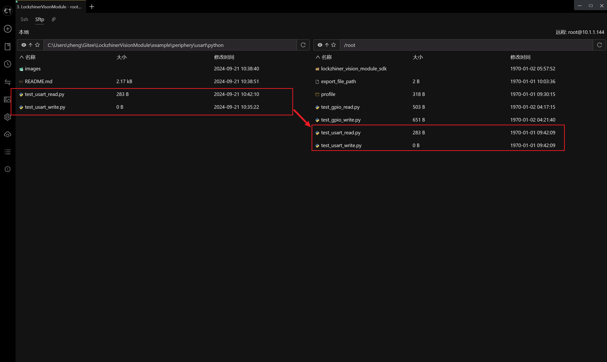
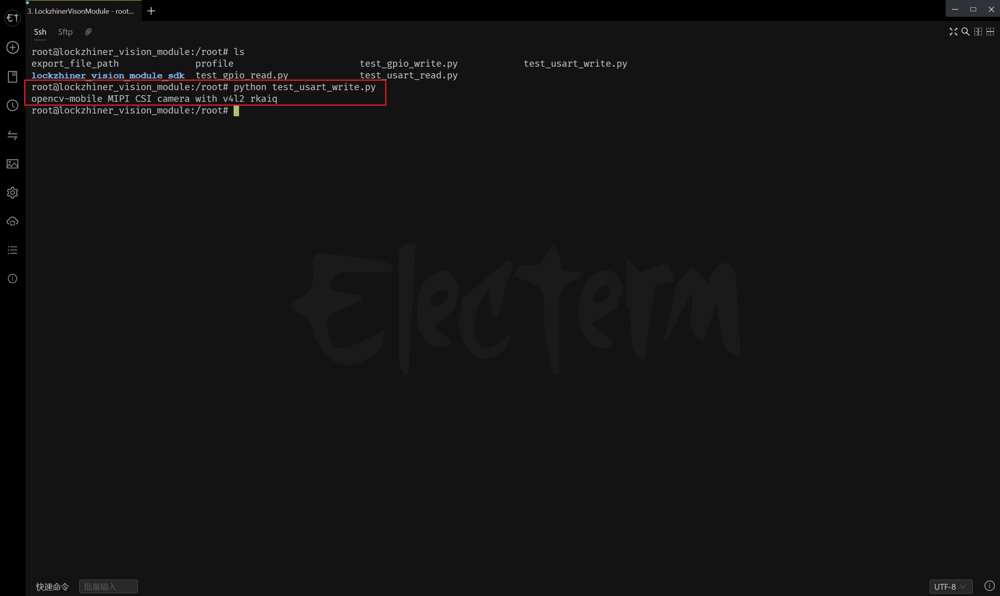
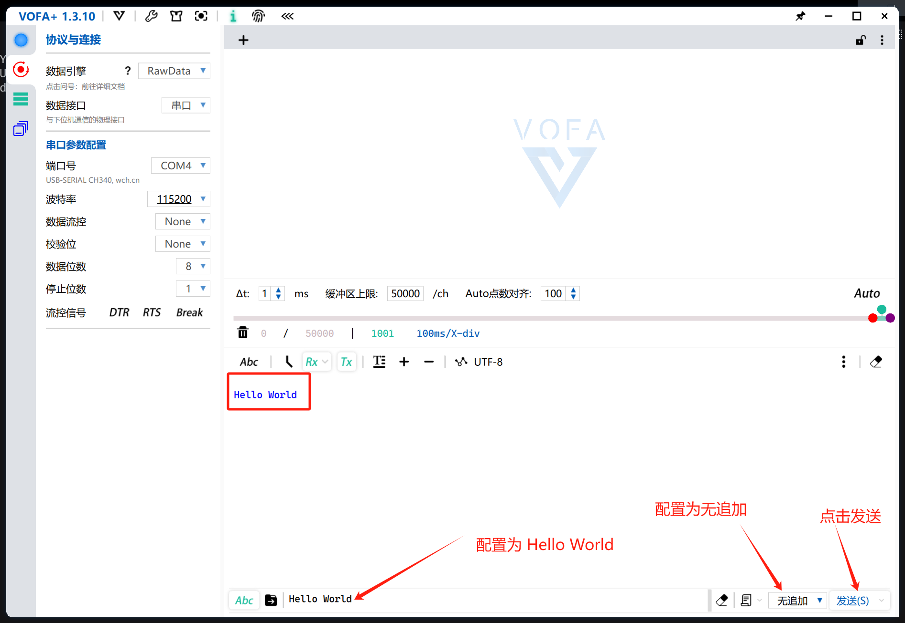
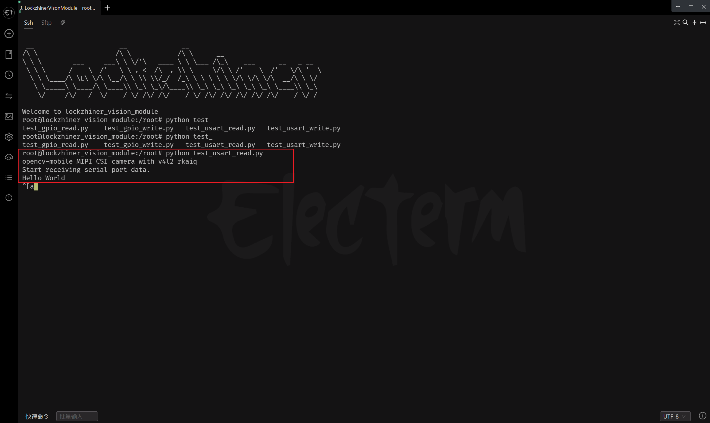

<h1 align="center">凌智视觉模块串口 Python 部署指南</h1>

发布版本：V0.0.0

日期：2024-09-21

文件密级：□绝密 □秘密 □内部资料 ■公开  

---

**免责声明**  

本文档按**现状**提供，福州凌睿智捷电子有限公司（以下简称**本公司**）不对本文档中的任何陈述、信息和内容的准确性、可靠性、完整性、适销性、适用性及非侵权性提供任何明示或暗示的声明或保证。本文档仅作为使用指导的参考。  

由于产品版本升级或其他原因，本文档可能在未经任何通知的情况下不定期更新或修改。  

**读者对象**  

本教程适用于以下工程师：  

- 技术支持工程师  
- 软件开发工程师  

**修订记录**  

| **日期**   | **版本** | **作者** | **修改说明** |
| :--------- | -------- | -------- | ------------ |
| 2024/09/21 | 0.0.0    | 郑必城     | 初始版本     |


## 1 简介

串口，也称为串行接口或串行通信接口，是一种用于连接计算机与外部设备并进行数据传输的接口技术。它使用较少的导线（通常只需要几根线），并且可以在较长的距离上可靠地进行数据传输。本章节中，我们将教会你如何使用 Lockzhiner Vision Module 上的串口进行传输数据。

## 2 前期准备

接下来让我们基于 Python 来部署串口例程，在开始本章节前：

- 在开始这个章节前，请确保你已经按照 [开发环境搭建指南](../../../../docs/introductory_tutorial/python_development_environment.md) 正确配置了开发环境。
- 请确保你已经按照 [凌智视觉模块串口使用指南](../README.md) 正确将信号连接到开发板并打开了串口工具。

## 3 API 文档

```python
class USARTBase:
    """
    @class USARTBase
    @brief USART 基础类，用于管理 USART （串行通信）模块的初始化和基本操作。

    此类提供了一个接口来打开、关闭、写入和读取USART模块。它依赖于一个具体的USART类实例来实现这些操作。
    """

    def __init__(self, usart_class):
        """
        @fn __init__(self, usart_class)
        @brief 构造函数，初始化 USARTBase 对象。

        @param usart_class 一个 USART 类，用于实际的 USART 模块操作。
        """
        self.usart = usart_class()

    def open(self, baud_rate=115200):
        """
        @fn open(self, baud_rate=115200)
        @brief 打开 USART 模块，设置波特率。

        @param baud_rate 波特率，默认为 115200。

        @return 打开操作的结果，通常由具体的 USART 类决定。
        """
        return self.usart.open(baud_rate)

    def close(self):
        """
        @fn close(self)
        @brief 关闭 USART 模块。

        @return 关闭操作的结果，通常由具体的 USART 类决定。
        """
        return self.usart.close()

    def write(self, data):
        """
        @fn write(self, data)
        @brief 向 USART 模块写入数据。

        @param data 要写入的数据。

        @return 写入操作的结果，通常由具体的 USART 类决定。
        """
        return self.usart.write(data)

    def read(self, data_size):
        """
        @fn read(self, data_size)
        @brief 从 USART 模块读取数据。

        @param data_size 要读取的数据大小。

        @return 读取到的数据，通常由具体的 USART 类决定。
        """
        return self.usart.read(data_size)
```

## 4 项目介绍

为了方便大家入手，我们将项目拆分为串口接受数据和串口发送数据两个部分。

串口接受例程的核心代码如下:

```python
from lockzhiner_vision_module.periphery import USART1


if __name__ == "__main__":
    usart = USART1()
    if usart.open(115200) is False:
        print("Failed to open usart.")
        exit(1)

    print("Start receiving serial port data.")

    while True:
        print(usart.read(1024))
```

串口发送例程的核心代码如下:

```python
from lockzhiner_vision_module.periphery import USART1


if __name__ == "__main__":
    usart = USART1()
    if usart.open(115200) is False:
        print("Failed to open usart.")
        exit(1)

    if usart.write("Hello World") is False:
        print("Failed to send data.")
        exit(0)
```

## 5 执行串口测试程序

参考 [连接设备指南](../../../../docs/introductory_tutorial/connect_device_using_ssh.md) 正确连接 Lockzhiner Vision Module 设备。


使用 SFTP 功能将软件上传到 Lockzhiner Vision Module



### 5.1 测试串口发送例程

```bash
python test_usart_write.py
```



vofa+ 上显示发送的字符串（Hello World）


### 5.2 测试串口接收例程

```bash
python test_usart_read.py
```

vofa+ 点击发送字符串（Hello World）



Lockzhiner Vision Module 打印接受到的字符串（Hello World）

