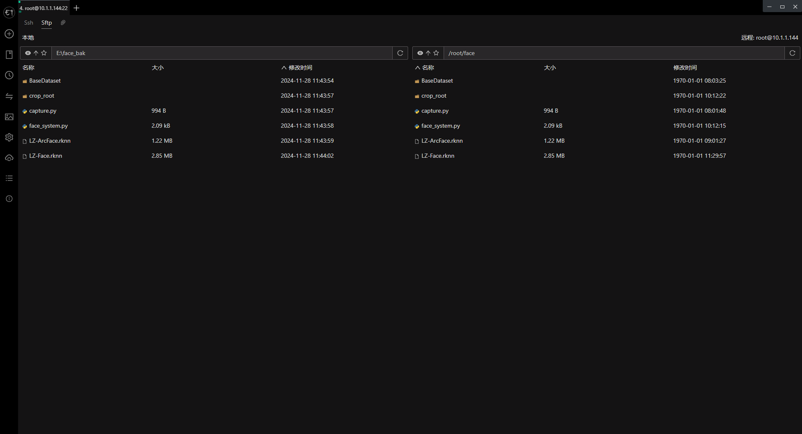

<h1 align="center">凌智视觉模块人脸识别系统 Python 部署指南</h1>

发布版本：V0.0.0

日期：2024-11-28

文件密级：□绝密 □秘密 □内部资料 ■公开  

---

**免责声明**  

本文档按**现状**提供，福州凌睿智捷电子有限公司（以下简称**本公司**）不对本文档中的任何陈述、信息和内容的准确性、可靠性、完整性、适销性、适用性及非侵权性提供任何明示或暗示的声明或保证。本文档仅作为使用指导的参考。  

由于产品版本升级或其他原因，本文档可能在未经任何通知的情况下不定期更新或修改。  

**读者对象**  

本教程适用于以下工程师：  

- 技术支持工程师  
- 软件开发工程师  

**修订记录**  

| **日期**     | **版本** | **作者**  | **修改说明** |
|:-----------| -------- |---------| ------------ |
| 2024/11/28 | 0.0.0    | 郑必城、钟海滨 | 初始版本     |

## 1 简介

接下来让我们基于 Python 来部署 ArcFace 人脸识别模型。在开始本章节前：

* 请确保你已经下载了 [凌智视觉模块人脸检测模型](https://gitee.com/LockzhinerAI/LockzhinerVisionModule/releases/download/v0.0.3/LZ-Face.rknn)
* 请确保你已经下载了 [凌智视觉模块人脸识别模型](https://gitee.com/LockzhinerAI/LockzhinerVisionModule/releases/download/v0.0.0/LZ-ArcFace.rknn)
- 请确保你已经按照 [开发环境搭建指南](../../../../docs/introductory_tutorial/python_development_environment.md) 正确配置了开发环境。

## 2 Python API 文档

```python
from ...LockzhinerVisionModule_wapper import vision


class FaceRecognitionSystem:
    def __init__(self):
        """
        FaceRecognitionSystem 类 - 用于人脸识别系统的封装
        该类封装了 InsightFace 框架下的 ArcFace 人脸识别模型以及PaddleDet 
        框架下的目标检测模型，提供了初始化和预测的方法
        """

        self.model = vision.FaceRecognitionSystem()

    def initialize(
        self,
        face_det_model_path,
        face_rec_model_path,
        face_det_param_path="",
        face_rec_param_path="",
        ):
        """
        初始化模型  
            - 加载预训练的 PaddlePaddle 模型
            - 加载预训练的 ArcFace 模型
        Args:
            face_det_model_path,    人脸检测模型文件的路径
            face_rec_model_path,    人脸识别模型文件的路径
            face_det_param_path="", 默认为空，不需填写
            face_rec_param_path="", 默认为空，不需填写

        Returns:
            bool: 初始化是否成功。
        """
        return self.model.initialize(
            face_det_model_path,
            face_rec_model_path,
            face_det_param_path,
            face_rec_param_path,)

    def buildDatabase(self, database_root, crop_root=""):
        """
        构建人脸识别数据库

        Args:
             database_root  用户人脸存储路径
             crop_root=""   裁剪图片存储路径(DEBUG时可开启)
        Returns:
            bool: 数据库构建是否成功。
        """
        return self.model.buildDatabase(database_root, crop_root)

    def predict(self, input_mat):
              """
        进行预测 - 使用加载的人脸检测模型和人脸是被模型进行预测
        Args:
            input_mat (cv2.Mat): 输入的图像数据，通常是一个 cv2.Mat 变量。

        Returns:
            FaceFeatureResults: 识别到的用户，余弦相似度分数，检测到的目标框
        """
        return self.model.predict(input_mat)

```

## 3 项目介绍

为了方便大家入手，我们做了一个简易的人脸识别例程。该程序可以使用摄像头进行端到端推理。

```python
import sys
import time

from lockzhiner_vision_module.cv2 import VideoCapture, imread, imwrite
from lockzhiner_vision_module.vision import FaceRecognitionSystem, visualize
from lockzhiner_vision_module.edit import Edit


# 主程序入口
if __name__ == '__main__':
    # 获取命令行参数
    args = sys.argv
    # 确保提供了足够的参数
    if len(args) != 5:
        print("Need model path. Example: python face_system.py LZ-Face.rknn LZ-ArcFace.rknn baseDataset_root crop_root")
        exit(1)

    # 初始化面部识别系统
    face_system = FaceRecognitionSystem()
    # 验证面部识别系统的初始化是否成功
    if face_system.initialize(args[1], args[2]) is False:
        print("Failed to initialize face_system model")
        exit(1)
    # 构建面部数据库
    face_system.buildDatabase(args[3],args[4])

    # 初始化图像编辑处理对象
    edit = Edit()
    # 开始并接受连接，准备进行图像编辑处理
    edit.start_and_accept_connection()
    # 初始化视频捕捉对象
    video_capture = VideoCapture()
    # 验证摄像头是否成功打开
    if video_capture.open(0) is False:
        print("Failed to open capture")
        exit(1)
    # 主循环，用于持续捕捉和处理视频帧
    while True:
        read_index = 0
        total_time_ms = 0
        for i in range(100):
            # 从摄像头读取帧
            ret, input_mat = video_capture.read()
            # 如果读取失败，则继续循环直到成功读取
            if ret is False:
                continue
            # 预测调用predict方法
            start_time = time.time()
            results = face_system.predict(input_mat)
            end_time = time.time()
            total_time_ms += end_time - start_time
            read_index += 1
            # 可视化处理结果
            vis_mat = visualize(input_mat, results)
            # 打印处理后的图像
            edit.print(vis_mat)
        print(f"FPS is {1.0 / (total_time_ms / read_index)}")

```

## 4 上传并测试 Python 程序

参考 [连接设备指南](../../../../docs/introductory_tutorial/connect_device_using_ssh.md) 正确连接 Lockzhiner Vision Module 设备。


请使用 Electerm Sftp 依次上传以下文件:

- 进入存放 **test_arc_face[face_system.py](face_system.py).py** 脚本文件的目录，将 **[face_system.py](face_system.py).py** 上传到 Lockzhiner Vision Module
- 进入存放 **LZ-ArcFace.rknn(也可能是其他模型)** 模型存放的目录（模型存放在训练模型后下载的 output 文件夹内），将 **LZ-ArcFace.rknn** 上传到 Lockzhiner Vision Module
- 进入存放 **LZ-Face.rknn(也可能是其他模型)** 模型存放的目录（模型存放在训练模型后下载的 output 文件夹内），将 **LZ-Face.rknn** 上传到 Lockzhiner Vision Module

人脸数据库文件夹结构示意图


 
上传文件




请使用 Electerm Ssh 并在命令行中执行以下命令:

```bash
python face_system.py LZ-Face.rknn LZ-ArcFace.rknn baseDataset_root crop_root
```

运行程序后，屏幕上开始打印数据库构建的相关信息，并在一段时间后输出 


