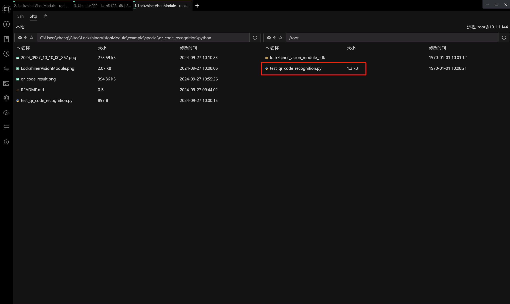
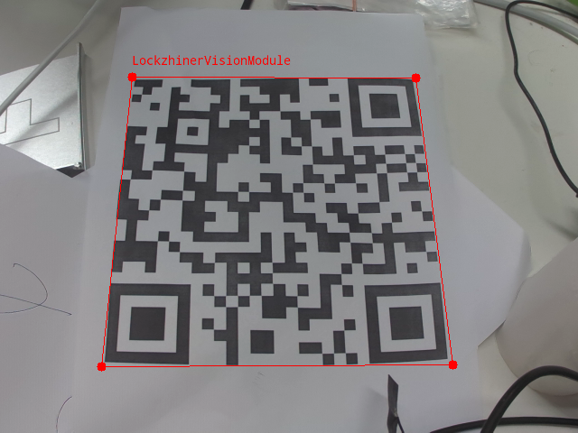

<h1 align="center">凌智视觉模块二维码识别 Python 部署指南</h1>

发布版本：V0.0.0

日期：2024-09-27

文件密级：□绝密 □秘密 □内部资料 ■公开  

---

**免责声明**  

本文档按**现状**提供，福州凌睿智捷电子有限公司（以下简称**本公司**）不对本文档中的任何陈述、信息和内容的准确性、可靠性、完整性、适销性、适用性及非侵权性提供任何明示或暗示的声明或保证。本文档仅作为使用指导的参考。  

由于产品版本升级或其他原因，本文档可能在未经任何通知的情况下不定期更新或修改。  

**读者对象**  

本教程适用于以下工程师：  

- 技术支持工程师  
- 软件开发工程师  

**修订记录**  

| **日期**   | **版本** | **作者** | **修改说明** |
| :--------- | -------- | -------- | ------------ |
| 2024/09/27 | 0.0.0    | 郑必城     | 初始版本     |

## 1 简介

接下来让我们基于 Python 来部署二维码识别案例，在开始本章节前：

- 请确保你已经参考 [凌智视觉模块摄像头部署指南](../../../periphery/capture/README.md) 正确下载了凌智视觉模块图片传输助手。
- 请确保你已经按照 [开发环境搭建指南](../../../../docs/introductory_tutorial/python_development_environment.md) 正确配置了开发环境。

## 2 Python API 文档

```python
class Point:
    def __init__(self):
        self.point = cv2.Point()

    @property
    def x(self):
        """
        获取矩形左上角坐标点的 x 坐标

        Returns:
            int: 获取矩形左上角坐标点的 x 坐标
        """
        return self.rect.x

    @property
    def y(self):
        """
        获取矩形左上角坐标点的 y 坐标

        Returns:
            int: 获取矩形左上角坐标点的 y 坐标
        """
        return self.rect.y

class CodeResult:
    """
    条码识别检测结果类，用于封装和处理条码识别结果数据。

    该类主要提供了一个包装层，用于访问和管理由视觉模块产生的条码识别结果。
    """

    def __init__(self):
        self.qr_code_result = vision.CodeResult()

    @property
    def top_left(self):
        """
        获取条码识别结果的左上角坐标

        Returns:
            Point: 左上角坐标
        """
        return self.qr_code_result.top_left

    @property
    def top_right(self):
        """
        获取条码识别结果的右上角坐标

        Returns:
            Point: 右上角坐标
        """
        return self.qr_code_result.top_right

    @property
    def bottom_left(self):
        """
        获取条码识别结果的左下角坐标

        Returns:
            Point: 左下角坐标
        """
        return self.qr_code_result.bottom_left

    @property
    def bottom_right(self):
        """
        获取条码识别结果的右下角坐标

        Returns:
            Point: 右下角坐标
        """
        return self.qr_code_result.bottom_right

    @property
    def text(self):
        """
        获取条码识别结果的文本数据

        Returns:
            Point: 条码识别结果的文本数据
        """
        return self.qr_code_result.text

class QRCodeDetector:
    """
    QRCodeDetector 类 - 用于二维码识别的封装类。
    """
    def __init__(self):
        self.model = vision.QRCodeDetector()

    def predict(self, input_mat):
        """
        进行预测

        Args:
            input_mat (cv2.Mat): 输入的图像数据，通常是一个 cv2.Mat 变量。

        Returns:
            list(CodeResult): 预测结果对象列表，每一个预测结果包含了二维码坐标和文本。
        """
        return self.model.predict(input_mat)
```

## 3 项目介绍

为了方便大家入手，我们做了一个简易的手写数字识别例程。该程序可以使用摄像头进行端到端推理，并可视化推理结果到凌智视觉模块图片传输助手。

```python
from lockzhiner_vision_module.cv2 import VideoCapture
from lockzhiner_vision_module.vision import QRCodeDetector, visualize
from lockzhiner_vision_module.edit import Edit
import sys

if __name__ == "__main__":
    edit = Edit()
    edit.start_and_accept_connection()

    model = QRCodeDetector()

    video_capture = VideoCapture()
    if video_capture.open(0) is False:
        print("Failed to open capture")
        exit(1)

    while True:
        ret, mat = video_capture.read()
        if ret is False:
            continue

        results = model.predict(mat)
        print(f"result size is {len(results)}")
        for result in results:
            top_left = result.top_left
            top_right = result.top_right
            bottom_left = result.bottom_left
            bottom_right = result.bottom_right
            text = result.text
            print(
                f"(top_left,top_right,bottom_left,bottom_right,text): [({top_left.x}),{top_left.y}),({top_right.x}),{top_right.y}),({bottom_left.x}),{bottom_left.y}),({bottom_right.x}),{bottom_right.y}),{text}]"
            )

        vis_mat = visualize(mat, results)
        edit.print(vis_mat)
```

## 4 上传并测试 Python 程序

参考 [连接设备指南](../../../../docs/introductory_tutorial/connect_device_using_ssh.md) 正确连接 Lockzhiner Vision Module 设备。


请使用 Electerm Sftp 依次上传以下两个文件:

- 进入存放 **test_qr_code_recognition.py** 脚本文件的目录，将 **test_qr_code_recognition.py** 上传到 Lockzhiner Vision Module



请使用 Electerm Ssh 并在命令行中执行以下命令:

```bash
python test_qr_code_recognition.py
```

运行程序后，使用凌智视觉模块图片传输助手连接设备，屏幕上开始打印二维码位置和置信度，凌智视觉模块图片传输助手出现可视化的结果



<!-- ## 5 其他 -->

<!-- 如果你需要使用 C++ 来部署 PaddleClas 请参考[凌智视觉模块分类模型 C++ 部署指南](../cpp/README.md)。 -->
