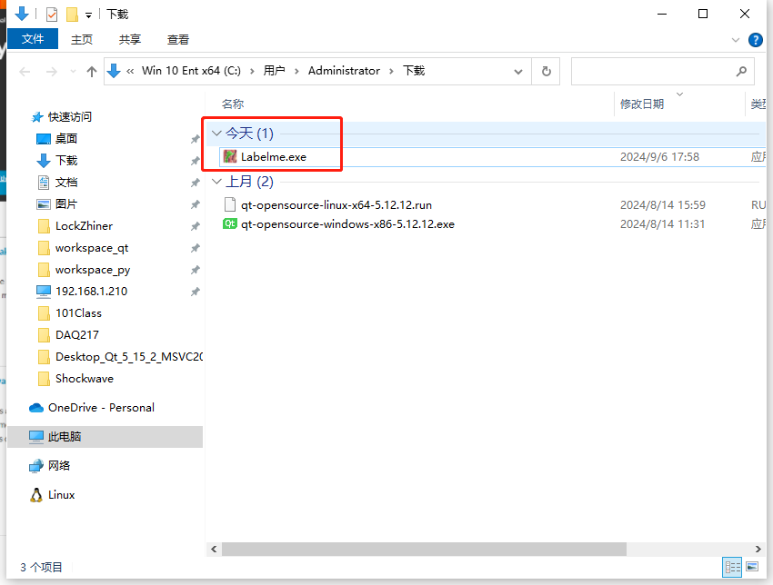
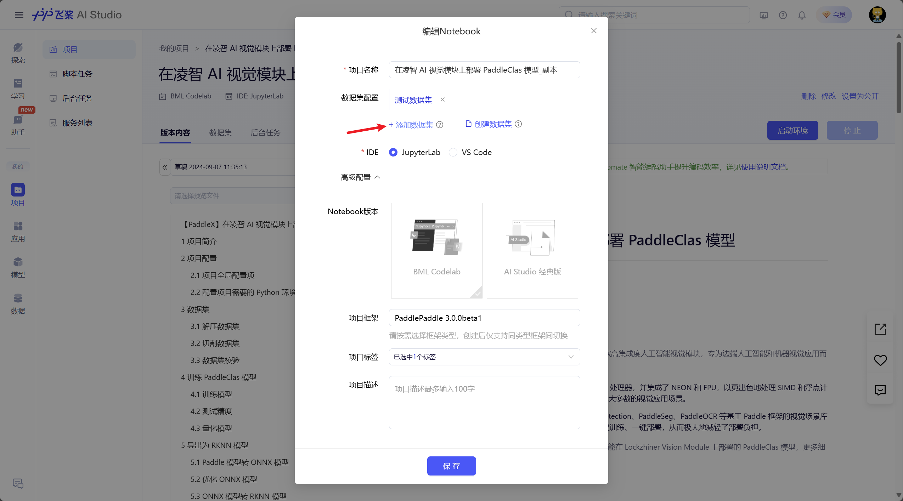

<h1 align="center">凌智视觉模块分类模型部署指南</h1>

发布版本：V0.0.0

日期：2024-09-11

文件密级：□绝密 □秘密 □内部资料 ■公开  

---

**免责声明**  

本文档按**现状**提供，福州凌睿智捷电子有限公司（以下简称**本公司**）不对本文档中的任何陈述、信息和内容的准确性、可靠性、完整性、适销性、适用性及非侵权性提供任何明示或暗示的声明或保证。本文档仅作为使用指导的参考。  

由于产品版本升级或其他原因，本文档可能在未经任何通知的情况下不定期更新或修改。  

**读者对象**  

本教程适用于以下工程师：  

- 技术支持工程师  
- 软件开发工程师  

**修订记录**  

| **日期**   | **版本** | **作者** | **修改说明** |
| :--------- | -------- | -------- | ------------ |
| 2024/09/11 | 0.0.0    | 郑必城     | 初始版本     |

## 1 简介

在深度学习中，分类模型是一类用于将输入数据分配到预定义类别或标签的模型。这类模型的主要目标是通过分析输入特征，将数据正确地归类到一个或多个类别中。在本章节中，我们将教你如何使用 PaddleX 和 PaddleSlim 训练一个分类模型并在凌智视觉模块上部署。

## 2 图像数据标注

### 2.1 Labelme 标注工具安装

Labelme 是一个 python 语言编写，带有图形界面的图像标注软件。可用于图像分类，目标检测，图像分割等任务，在图像分类的标注任务中，标签存储为 JSON 文件。在本章节中，我们使用这个软件来标注数据。

首先，点击 [Labelme 下载地址](https://sourceforge.net/projects/labelme-ima-polygonal.mirror/files/v5.5.0/Labelme.exe/download)，耐心等待几秒后，浏览器将自动开始下载 Labelme，如下图：


一般来说，下载完成后，系统的下载文件夹内将多出 **Labelme.exe**



> 注:
> 
> 如果网速太慢，我们也提供了百度网盘的下载链接，点击链接 [Labelme 标注工具(提取码:cyqc)](https://pan.baidu.com/s/1ssdBXxhoE1tME3nh-xqNzQ) 即可下载

### 2.2 标注前的准备

首先，请参考 [摄像头使用指南](./example/periphery/capture) 利用 **Lockzhiner Vision Module 图片获取助手** 拍摄你需要进行标注的图片，如下图所示：


选择一个你想存放数据集的位置，将 **Labelme.exe** 移动到文件夹下同时创建一个空的文件夹并命名为 **Dataset**，如下图：


进入 **Dataset** 文件夹，创建 **images** 文件夹、**annotations** 文件夹、**flags.txt** 文件，如下图:


进入 **Dataset** 文件夹，打开 **images**目录，将 **Lockzhiner Vision Module 图片获取助手** 保存的图片数据（在程序运行目录的 **LockzhinerVisionModuleImages** 文件夹内）移动到该文件夹内，如下图：


进入 **Dataset** 文件夹，打开 **flags.txt** 按行写入待标注数据集的类别。由于我们的数据集将数据分为两类（**good** 和 **bad**），因此向文件中分别写入 good 和 bad，写入完成后如下图所示：


进入 **Dataset** 文件夹所在的目录，按住键盘`Shift`键后，单击鼠标右键，点击 **在此处打开 Powershell 窗口**。


弹出 **Powershell 窗口**后，输入以下命令来打开 **Labelme**，如下图：

```bash
.\Labelme.exe .\Dataset\images --nodata --autosave --output .\Dataset\annotations --flags .\Dataset\flags.txt
```


命令执行后将打开 **Labelme** 程序，如下图


### 2.3 标注并产出数据集

打开 **Labelme** 后，我们开始标记图像，勾选右边"标记"方块内的类别对图像进行标记，点击文件列表切换需要标注的图像，请耐心对拍摄的每一张图片进行标注。


进入 **Dataset** 文件夹所在的目录，将 Dataset 目录压缩为文件夹。注意，压缩包的最外层需要有 Dataset 目录。这里我们建议你使用 Bandzip 压缩软件进行压缩，具体的操作步骤如下：


压缩完成后，打开压缩文件检查下最外层是否有 Dataset 目录


## 3 使用 AIStudio 训练分类模型

### 3.1 简介

AI Studio 是基于百度深度学习开源平台飞桨的人工智能学习与实训社区，为开发者提供了功能强大的线上训练环境、免费GPU算力及存储资源。Lockzhiner Vision Module 默认使用 AI Studio 进行快速训练。

### 3.2 登录 AIStudio

进入 [AI Studio](https://aistudio.baidu.com)，点击右上角的登录按钮，输入你的百度账号进行登录。


### 3.3 上传数据集文件

点击**数据**，点击**创建数据集**来打开数据集创建界面，如下图:


正确填入合适的内容，如下图：


耐心等待数据集上传完成，完成后点击 **确定**，如下图：


### 3.4 Fork 项目

进入 [【PaddleX】在凌智 AI 视觉模块上部署 PaddleClas 模型](https://aistudio.baidu.com/projectdetail/8285578?sUid=790375&shared=1&ts=1725690007105) 项目，点击右上角的 **Fork** 图标来创建自己的项目，如下图：


正确填入合适的内容，如下图：


点击取消按钮，如下图：


### 3.5 配置项目数据集

点击最左侧**项目**按钮，然后点击中间**项目**按钮，找到刚才 Fork 的项目，如下图：


点击右上角 **修改**，点击**添加数据集**，点击**个人数据集**，找到刚才创建的数据集并点击**添加**，点击**保存**按钮，如下图：





### 3.6 启动项目

点击**启动环境**，选择 **V100 16GB**，点击**确定**，如下图


耐心等待一段时间来启动项目，点击**进入**到项目中，如下图:


### 3.7 配置项目训练参数

点击 **data**，查看并复制数据集保存目录（右键数据集保存目录，点击重命名来复制），如下图：


找到**项目全局配置项**，配置数据集路径，我这里是 **data293515**，如下图:


配置分类目标参数，之前数据集是两类，因此这边配置为2，如下图：


### 3.8 开始训练

点击**运行全部 Cell** 开启训练，耐心等待训练完成，如下图：


训练完成后，主目录下会出现 **output** 文件夹，文件夹内包含了一个 ONNX 模型和一个 RKNN 模型，如下图：


选中 **output** 文件夹，右键鼠标，点击 **打包选中文件夹**。打包完成后，出现 **output.zip** 文件，右键该文件，点击**下载**。


## 4 在凌智视觉模块上部署模型

训练完模型后，请参考以下教程在凌智视觉模块上部署分类模型例程：

<!-- * [凌智视觉模块分类模型 C++ 部署指南](./cpp) -->
- [凌智视觉模块分类模型 Python 部署指南](./python)

## 5 各模型性能指标

以下测试数据为模型执行 Predict 函数运行 1000 次耗时的平均时间

| 分类模型 | FPS(帧/s) | 精度(%) |
|:-------:|:----:|:----:|
|LZ-MobileNetV3|40|75.32|
