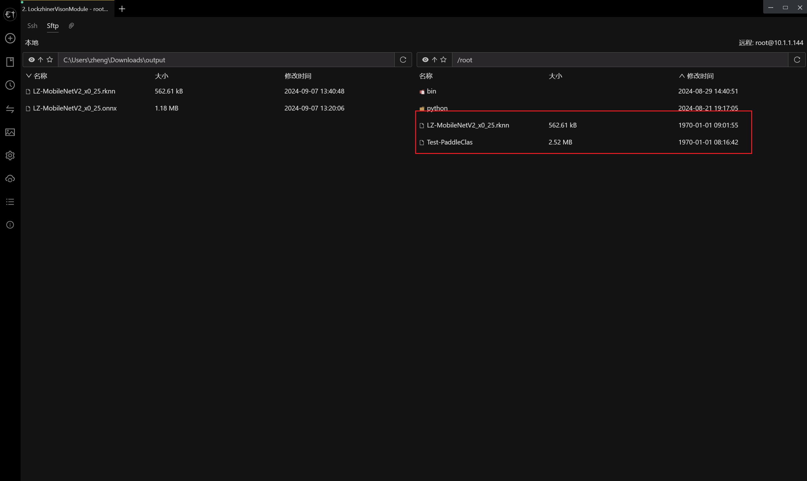

<h1 align="center">凌智视觉模块分类模型 C++ 部署指南</h1>

发布版本：V0.0.0

日期：2024-09-11

文件密级：□绝密 □秘密 □内部资料 ■公开  

---

**免责声明**  

本文档按**现状**提供，福州凌睿智捷电子有限公司（以下简称**本公司**）不对本文档中的任何陈述、信息和内容的准确性、可靠性、完整性、适销性、适用性及非侵权性提供任何明示或暗示的声明或保证。本文档仅作为使用指导的参考。  

由于产品版本升级或其他原因，本文档可能在未经任何通知的情况下不定期更新或修改。  

**读者对象**  

本教程适用于以下工程师：  

- 技术支持工程师  
- 软件开发工程师  

**修订记录**  

| **日期**   | **版本** | **作者** | **修改说明** |
| :--------- | -------- | -------- | ------------ |
| 2024/09/11 | 0.0.0    | 郑必城     | 初始版本     |

## 1 简介

接下来让我们基于 C++ 来部署 PaddleClas 分类模型。在开始本章节前：

- 请确保你已经参考 [凌智视觉模块分类模型部署指南](../README.md) 对模型进行了充分训练。
- 请确保你已经按照 [开发环境搭建指南](../../../../docs/introductory_tutorial/cpp_development_environment.md) 正确配置了开发环境。

## 2 C++ API 文档

```cpp
/// \struct ClassificationResult
/// \brief ClassificationResult 结构体 - 用于存储图像分类的结果。
///
/// 该结构体包含了图像分类结果的基本信息，包括分类的标签ID和置信度。
struct ClassificationResult {
  /// \brief 默认构造函数。
  ///
  /// 创建一个默认的 ClassificationResult 实例，其中 label_id 初始化为
  /// -1，表示空结果，confidence 初始化为 0.0。
  ClassificationResult() = default;

  /// \brief 拷贝构造函数。
  ///
  /// 创建一个新的 ClassificationResult 实例，并将其初始化为与另一个
  /// ClassificationResult 实例相同的状态。
  ClassificationResult(const ClassificationResult& other) = default;

  /// \brief 移动赋值运算符。
  ///
  /// 将一个右值 ClassificationResult 实例的资源移动到当前实例中。
  ///
  /// \param other 要移动的 ClassificationResult 实例。
  /// \return 对当前 ClassificationResult 实例的引用。
  ClassificationResult& operator=(ClassificationResult&& other);

  /// \brief 判断结果是否为空。
  ///
  /// 检查 label_id 是否为 -1，如果是，则表示结果为空（即没有有效的分类结果）。
  ///
  /// \return 如果结果为空，则返回 true；否则返回 false。
  bool Empty() { return label_id != -1; }

  /// \brief 分类的标签ID。
  ///
  /// 存储分类结果的标签ID，用于标识分类的类别。-1 表示结果为空。
  int32_t label_id = -1;

  /// \brief 分类的置信度。
  ///
  /// 存储分类结果的置信度，表示模型对分类结果的信任程度。值为 0.0 到 1.0
  /// 之间的浮点数。
  float confidence = 0.0;
};

/// \class PaddleClas
/// \brief PaddleClas 类 - 基于 PaddlePaddle 的图像分类模型基类。
///
/// 该类继承自
/// BaseModel，是图像分类模型的基础类，提供了预测、预处理和后处理的方法接口。
/// 通过派生类可以实现具体的图像分类模型，如 PPLCNet 和 MobileNetV2。
class PaddleClas : public BaseModel {
 public:
  /// \brief 默认构造函数。
  ///
  /// 创建一个 PaddleClas 实例。
  PaddleClas() = default;

  /// \brief 虚析构函数。
  ///
  /// 释放 PaddleClas 实例所占用的资源。
  ~PaddleClas() override = default;

  /// \brief 初始化模型推理后端
  ///
  /// 初始化模型推理后端并返回是否初始化成功
  ///
  /// \param model 传入 RKNN 模型路径
  /// \return 初始化是否成功
  bool Initialize(void* model);
  
  /// \brief 进行图像分类预测。
  ///
  /// 使用 PaddleClas 模型对输入的图像进行分类预测，并将结果存储在提供的
  /// ClassificationResult 对象中。
  ///
  /// \param mat 输入的图像数据，类型为 cv::Mat。
  /// \param result 存储预测结果的 ClassificationResult 对象。
  /// \return 预测是否成功。
  bool Predict(const cv::Mat& mat, ClassificationResult& result);
};
```

## 3 项目介绍

为了方便大家入手，我们做了一个简易的图像分类例程。根据输入参数的不同，该程序可以测试模型的推理速度或使用摄像头进行端到端推理。

```cmake
cmake_minimum_required(VERSION 3.10)

project(test_classification)

# 定义项目根目录路径
set(PROJECT_ROOT_PATH "${CMAKE_CURRENT_SOURCE_DIR}/../../..")
# 定义 OpenCV SDK 路径
set(OpenCV_ROOT_PATH "${PROJECT_ROOT_PATH}/third_party/opencv-mobile-4.10.0-lockzhiner-vision-module")
set(OpenCV_DIR "${OpenCV_ROOT_PATH}/lib/cmake/opencv4")
find_package(OpenCV REQUIRED)
set(OPENCV_LIBRARIES "${OpenCV_LIBS}")
# 定义 LockzhinerVisionModule SDK 路径
set(LockzhinerVisionModule_ROOT_PATH "${PROJECT_ROOT_PATH}/third_party/lockzhiner_vision_module_sdk")
set(LockzhinerVisionModule_DIR "${LockzhinerVisionModule_ROOT_PATH}/lib/cmake/lockzhiner_vision_module")
find_package(LockzhinerVisionModule REQUIRED)

add_executable(Test-PaddleClas Test-PaddleClas.cpp)
target_include_directories(Test-PaddleClas PRIVATE ${LOCKZHINER_VISION_MODULE_INCLUDE_DIRS})
target_link_libraries(Test-PaddleClas PRIVATE ${OPENCV_LIBRARIES} ${LOCKZHINER_VISION_MODULE_LIBRARIES})
```

例程的核心代码如下:

```cpp
#include <lockzhiner_vision_module/vision/model/classification/PaddleClas.h>

#include <chrono>
#include <cstdlib>  // for std::rand and std::srand
#include <ctime>    // for std::time
#include <iostream>
#include <opencv2/opencv.hpp>

using namespace std::chrono;

lockzhiner_vision_module::vision::PaddleClas model;

int TestFPS() {
  // 创建一个空的3通道Mat，宽640，高480，类型为CV_8UC3
  std::srand(static_cast<unsigned int>(std::time(nullptr)));
  cv::Mat input_mat(480, 640, CV_8UC3);
  for (int i = 0; i < input_mat.rows; ++i) {
    for (int j = 0; j < input_mat.cols; ++j) {
      input_mat.at<cv::Vec3b>(i, j)[0] = std::rand() % 256;  // B通道
      input_mat.at<cv::Vec3b>(i, j)[1] = std::rand() % 256;  // G通道
      input_mat.at<cv::Vec3b>(i, j)[2] = std::rand() % 256;  // R通道
    }
  }

  constexpr int run_index = 1000;
  int time_ms = 0;
  lockzhiner_vision_module::vision::ClassificationResult result;
  for (int i = 0; i < run_index; i++) {
    high_resolution_clock::time_point start_time = high_resolution_clock::now();
    if (!model.Predict(input_mat, result)) {
      std::cout << "Failed to do predict." << std::endl;
      return 1;
    }
    high_resolution_clock::time_point end_time = high_resolution_clock::now();
    auto time_span = duration_cast<milliseconds>(end_time - start_time);
    time_ms += time_span.count();
  }
  std::cout << "Frames per second: " << 1000.0 / time_ms * run_index << std::endl;
  return 0;
}

int TestCapture() {
  cv::VideoCapture cap;  // 设置摄像头长宽
  cap.set(cv::CAP_PROP_FRAME_WIDTH, 640);
  cap.set(cv::CAP_PROP_FRAME_HEIGHT, 480);
  // 打开摄像头
  cap.open(0);

  cv::Mat input_mat;
  lockzhiner_vision_module::vision::ClassificationResult result;
  while (true) {
    int read_index = 0;
    int time_ms = 0;
    for (int i = 0; i < 30; i++) {
      high_resolution_clock::time_point start_time =
          high_resolution_clock::now();
      cap >> input_mat;
      // 判断获取的图片是否为空
      if (input_mat.empty()) {
        continue;
      }
      if (!model.Predict(input_mat, result)) {
        std::cout << "Failed to do predict." << std::endl;
        return 1;
      }
      high_resolution_clock::time_point end_time = high_resolution_clock::now();
      auto time_span = duration_cast<milliseconds>(end_time - start_time);
      time_ms += time_span.count();
      read_index += 1;
      std::cout << "confidence is " << result.confidence << ";label_id is "
                << result.label_id << std::endl;
    }
    std::cout << "Frames per second: " << 1000.0 / time_ms * read_index
              << std::endl;
    return 0;
  }
}

int main(int argc, char *argv[]) {
  if (argc != 3) {
    std::cerr << "Usage: Test-PaddleClas model_path <Capture|FPS>" << std::endl;
    return 1;
  }

  if (!model.Initialize(argv[1])) {
    std::cout << "Failed to initialize model." << std::endl;
    return 1;
  }
  std::cout << "Initialize runtime succeed." << std::endl;

  std::string argument(argv[2]);

  if (argument == "Capture") {
    return TestCapture();
  } else if (argument == "FPS") {
    return TestFPS();
  } else {
    std::cerr << "Invalid argument: " << argument
              << ". Use either 'Capture' or 'FPS'." << std::endl;
    return 1;
  }

  return 0;
}
```

## 4 部署模型

使用 Docker Destop 打开 LockzhinerVisionModule 容器并执行以下命令来编译项目

```bash
# 进入 Demo 目录
cd /LockzhinerVisionModuleWorkSpace/LockzhinerVisionModule/example/vision/classification/cpp

# 创建编译目录
rm -rf build && mkdir build && cd build

# 配置交叉编译工具链
export TOOLCHAIN_ROOT_PATH=${PWD}/../../../../../../arm-rockchip830-linux-uclibcgnueabihf

# 使用 cmake 配置项目
cmake -DCMAKE_TOOLCHAIN_FILE=../../../../../toolchains/arm-rockchip830-linux-uclibcgnueabihf.toolchain.cmake \
      -DCMAKE_BUILD_TYPE=Release \
      ..

# 执行编译
make -j8
```

### 4.3 执行分类模型测试程序

参考 [连接设备指南](../../../../docs/introductory_tutorial/connect_device_using_ssh.md) 正确连接 Lockzhiner Vision Module 设备。


参考之前的例程，将 **Test-PaddleClas** 传输到 Lockzhiner Vision Module 上。将 output 文件夹解压，将 LZ-MobileNetV2_x0_25.rknn 传输到 Lockzhiner Vision Module 上。



传输完成后执行以下代码

```bash
chmod +x ./Test-PaddleClas
# ./Test-PaddleClas 模型路径 FPS -> 测试模型运行 FPS
./Test-PaddleClas ./LZ-MobileNetV2_x0_25.rknn FPS
# ./Test-PaddleClas 模型路径 Capture -> 测试摄像头获取数据时的模型运行 FPS 
./Test-PaddleClas ./LZ-MobileNetV2_x0_25.rknn Capture
```

程序将读取摄像头数据，使用神经网络检测后输出置信度和类别:


## 5 其他

如果你需要使用 Python 来部署 PaddleClas 请参考 [凌智视觉模块分类模型 Python 部署指南](../python/README.md)。
