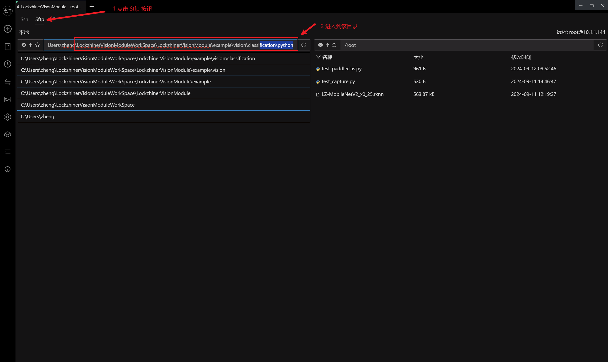
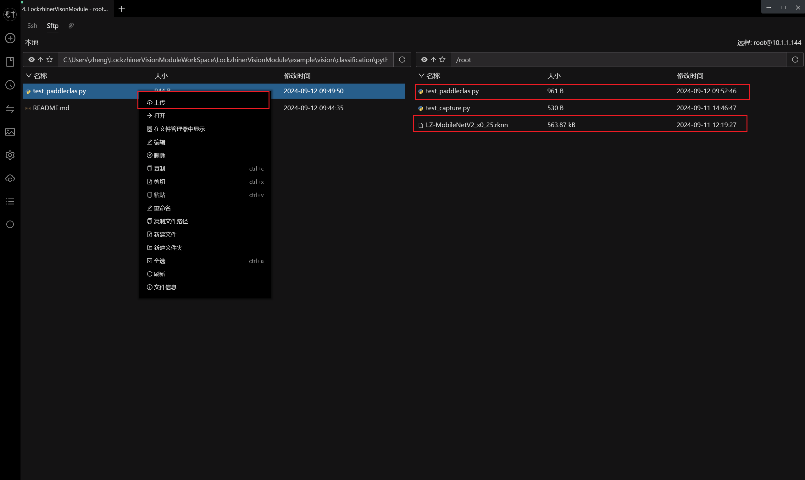
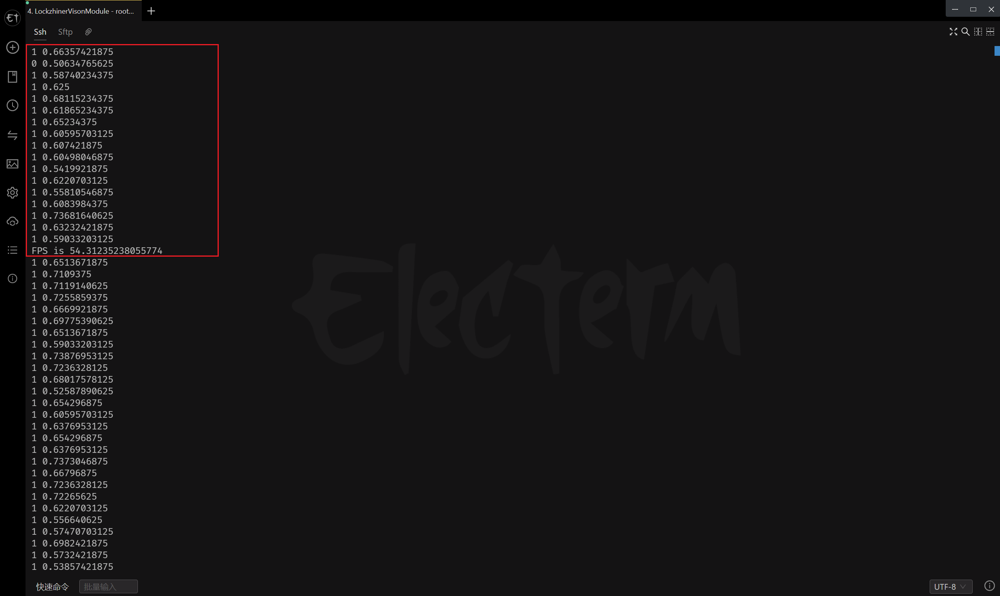

<h1 align="center">凌智视觉模块分类模型 Python 部署指南</h1>

发布版本：V0.0.0

日期：2024-09-11

文件密级：□绝密 □秘密 □内部资料 ■公开  

---

**免责声明**  

本文档按**现状**提供，福州凌睿智捷电子有限公司（以下简称**本公司**）不对本文档中的任何陈述、信息和内容的准确性、可靠性、完整性、适销性、适用性及非侵权性提供任何明示或暗示的声明或保证。本文档仅作为使用指导的参考。  

由于产品版本升级或其他原因，本文档可能在未经任何通知的情况下不定期更新或修改。  

**读者对象**  

本教程适用于以下工程师：  

- 技术支持工程师  
- 软件开发工程师  

**修订记录**  

| **日期**   | **版本** | **作者** | **修改说明** |
| :--------- | -------- | -------- | ------------ |
| 2024/09/11 | 0.0.0    | 郑必城     | 初始版本     |

## 1 简介

接下来让我们基于 Python 来部署 PaddleClas 分类模型。在开始本章节前：

- 请确保你已经参考 [凌智视觉模块分类模型部署指南](../README.md) 对模型进行了充分训练。
- 请确保你已经按照 [开发环境搭建指南](../../../../docs/introductory_tutorial/python_development_environment.md) 正确配置了开发环境。

## 2 Python API 文档

```python
class ClassificationResult:
    """
    分类结果类，用于封装和处理分类结果数据。

    该类主要提供了一个包装层，用于访问和管理由视觉模块产生的分类结果。
    它包含了两个属性： label_id 和 confidence ，分别表示分类的标签 ID 和置信度。
    """

    def __init__(self):
        """
        构造函数，初始化分类结果对象。

        这里会创建一个新的 vision.ClassificationResult 对象，并将其赋值给 self.classification_result。
        """
        self.classification_result = vision.ClassificationResult()

    @property
    def label_id(self):
        """
        获取分类结果的标签 ID。

        Returns:
            int: 分类结果的标签 ID ，表示识别出的物体的类别。
        """
        return self.classification_result.label_id

    @property
    def score(self):
        """
        获取分类结果的标签 ID。

        Returns:
            float: 分类结果的置信度，表示识别结果的可靠程度，范围为 0 到 1。
        """
        return self.classification_result.score


class PaddleClas:
    """
    PaddleClas 类 - 用于图像分类的 PaddlePaddle 模型封装。

    该类封装了 PaddlePaddle 框架下的图像分类模型，提供了初始化和预测的方法。
    """

    def __init__(self):
        """
        构造函数 - 初始化 PaddleClas 对象。

        创建一个新的 PaddleClas 实例， 并初始化内部的 PaddlePaddle 模型。
        """
        self.model = vision.PaddleClas()

    def initialize(self, model_path):
        """
        初始化模型 - 加载预训练的PaddlePaddle模型。

        Args:
            model_path (str): 模型文件的路径。

        Returns:
            bool: 初始化是否成功。
        """
        return self.model.initialize(model_path)

    def predict(self, input_mat):
        """
        进行预测 - 使用加载的模型对输入数据进行分类预测。

        Args:
            input_mat (cv2.Mat): 输入的图像数据，通常是一个 cv2.Mat 变量。

        Returns:
            ClassificationResult: 预测结果对象，包含了分类的标签、置信度等信息。
        """
        return self.model.predict(input_mat)
```

## 3 项目介绍

为了方便大家入手，我们做了一个简易的图像分类例程。该程序可以使用摄像头进行端到端推理。

```python
from lockzhiner_vision_module.cv2 import VideoCapture
from lockzhiner_vision_module.vision import PaddleClas
import time
import sys

if __name__ == "__main__":
    args = sys.argv
    if len(args) != 2:
        print("Need model path. Example: python test_classification.py LZ-MobileNetV3.rknn")
        exit(1)

    model = PaddleClas()
    if model.initialize(args[1]) is False:
        print("Failed to initialize PaddleClas")
        exit(1)

    video_capture = VideoCapture()
    if video_capture.open(0) is False:
        print("Failed to open capture")
        exit(1)

    while True:
        read_index = 0
        total_time_ms = 0
        for i in range(30):
            start_time = time.time()
            ret, mat = video_capture.read()
            if ret is False:
                continue

            result = model.predict(mat)
            end_time = time.time()
            total_time_ms += end_time - start_time
            read_index += 1
            print(result.label_id, result.score)
        print(f"FPS is {1.0 / (total_time_ms/read_index)}")
```

## 4 上传并测试 Python 程序

参考 [连接设备指南](../../../../docs/introductory_tutorial/connect_device_using_ssh.md) 正确连接 Lockzhiner Vision Module 设备。


请使用 Electerm Sftp 依次上传以下两个文件:

- 进入存放 **test_classification.py** 脚本文件的目录，将 **test_classification.py** 上传到 Lockzhiner Vision Module
- 进入存放 **LZ-MobileNetV3.rknn** 模型存放的目录（模型存放在训练模型后下载的 output 文件夹内），将 **LZ-MobileNetV3.rknn** 上传到 Lockzhiner Vision Module





请使用 Electerm Ssh 并在命令行中执行以下命令:

```bash
python test_classification.py LZ-MobileNetV3.rknn
```

运行程序后，屏幕上开始打印标签索引，分类置信度，并在一段时间后输出 FPS 值



<!-- ## 5 其他

如果你需要使用 C++ 来部署 PaddleClas 请参考[凌智视觉模块分类模型 C++ 部署指南](../cpp/README.md)。 -->
