<h1 align="center">凌智视觉模块检测模型部署指南</h1>

发布版本：V0.0.0

日期：2024-09-11

文件密级：□绝密 □秘密 □内部资料 ■公开  

---

**免责声明**  

本文档按**现状**提供，福州凌睿智捷电子有限公司（以下简称**本公司**）不对本文档中的任何陈述、信息和内容的准确性、可靠性、完整性、适销性、适用性及非侵权性提供任何明示或暗示的声明或保证。本文档仅作为使用指导的参考。  

由于产品版本升级或其他原因，本文档可能在未经任何通知的情况下不定期更新或修改。  

**读者对象**  

本教程适用于以下工程师：  

- 技术支持工程师  
- 软件开发工程师  

**修订记录**  

| **日期**   | **版本** | **作者** | **修改说明** |
| :--------- | -------- | -------- | ------------ |
| 2024/09/11 | 0.0.0    | 郑必城     | 初始版本     |

## 1 简介

## 2 图像数据标注

### 2.1 Labelme 标注工具安装

Labelme 是一个 python 语言编写，带有图形界面的图像标注软件。可用于图像分类，目标检测，图像分割等任务，在图像分类的标注任务中，标签存储为 JSON 文件。在本章节中，我们使用这个软件来标注数据。

首先，点击 [Labelme 下载地址](https://sourceforge.net/projects/labelme-ima-polygonal.mirror/files/v5.5.0/Labelme.exe/download)，耐心等待几秒后，浏览器将自动开始下载 Labelme，如下图：


一般来说，下载完成后，系统的下载文件夹内将多出 **Labelme.exe**


> 注:
> 
> 如果网速太慢，我们也提供了百度网盘的下载链接，点击链接 [Labelme 标注工具(提取码:cyqc)](https://pan.baidu.com/s/1ssdBXxhoE1tME3nh-xqNzQ) 即可下载
>
### 2.2 标注过程

#### 2.2.1 准备待标注数据

请参考 [摄像头使用指南](../../periphery/capture/README.md) 利用 **Lockzhiner Vision Module 图片获取助手** 拍摄你需要进行标注的图片，如下图所示：


选择一个你想存放数据集的位置，将 **Labelme.exe** 移动到文件夹下同时创建一个空的文件夹并命名为 **Dataset**，如下图

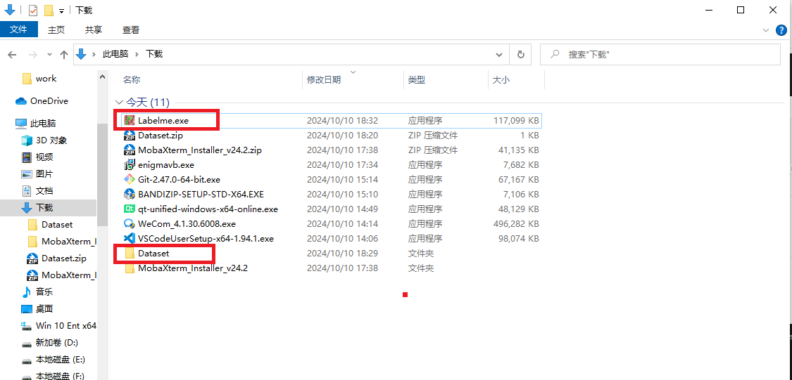

进入 **Dataset** 文件夹，创建 **images** 文件夹、**annotations** 文件夹、**flags.txt** 文件，如下图:

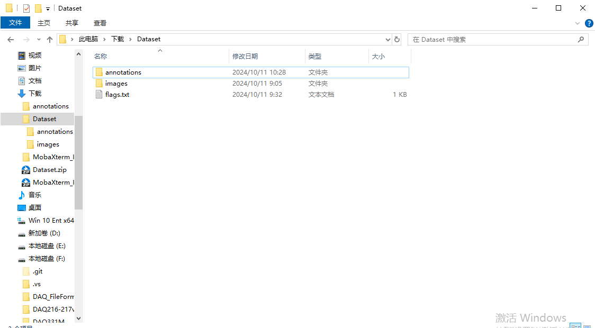

然后打开 **flags.txt** ，并在 **flags.txt** 中按行写入待标注数据集的类别。如下图所示：

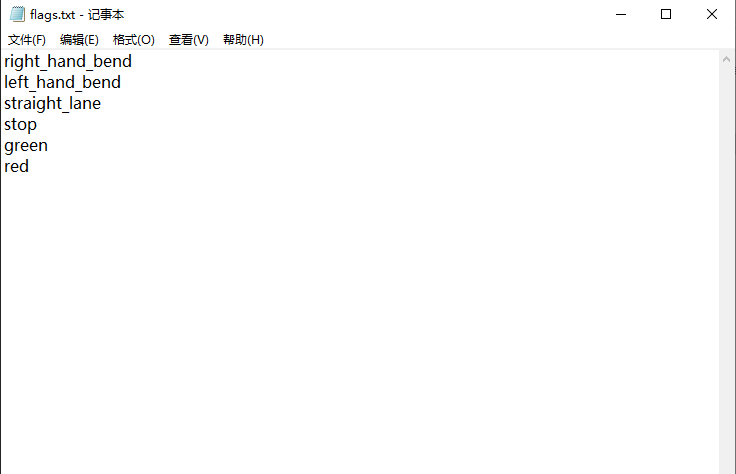

#### 2.2.2 启动 Labelme

进入 Dataset 文件夹所在的目录，按住键盘Shift键后，单击鼠标右键，点击 在此处打开 Powershell 窗口

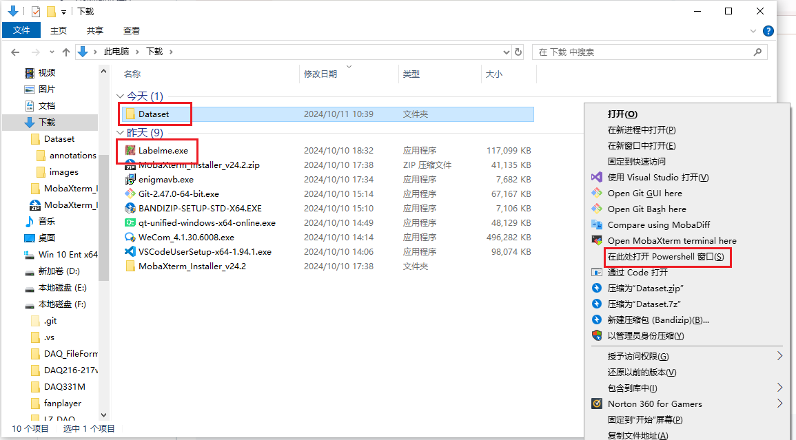

弹出 Powershell 窗口后，输入以下命令来打开 Labelme，如下图

```bash
.\Labelme.exe .\Dataset\images --labels .\Dataset\flags.txt --nodata --autosave --output .\Dataset\annotations  
```
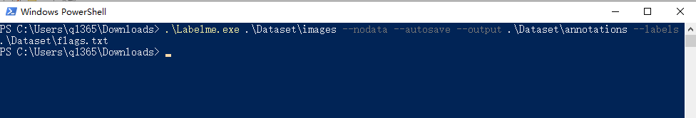

参数意义如下：

* --labels 类别标签路径。
* --nodata 停止将图像数据存储到JSON文件。
* --autosave 自动存储
* --ouput 标签文件存储路径

#### 2.2.3 开始图片标注

1、启动 **labelme** 后如图所示：

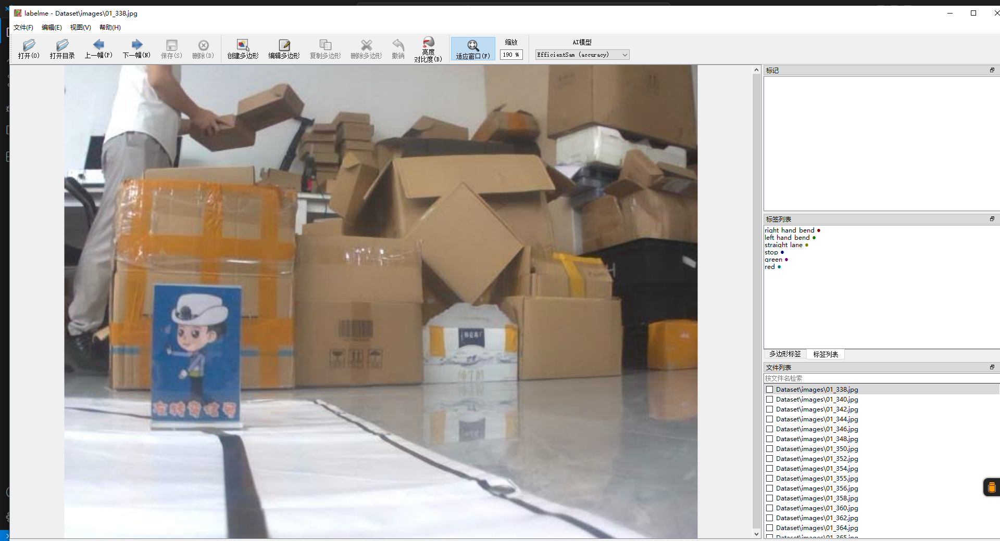

2、点击"编辑"选择标注类型

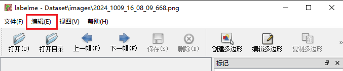

3、选择创建矩形框


4、在图片上拖动十字框选目标区域


5、再次点击选择目标框类别


6、标注好后点击存储。（若在启动 **labelme** 时未指定 --output 字段，会在第一次存储时提示选择存储路径，若指定 --autosave 字段使用自动保存，则无需点击存储按钮）


7、然后点击"下一幅"进行下一张图片的标注


8、最终标注好的标签文件如图所示


### 2.3 打包文件

进入 **Dataset** 文件夹所在的目录，将 **Dataset** 目录压缩为文件夹。注意，压缩包的最外层需要有 **Dataset** 目录。这里我们建议你使用 **Bandzip** 压缩软件进行压缩，具体的操作步骤如下：

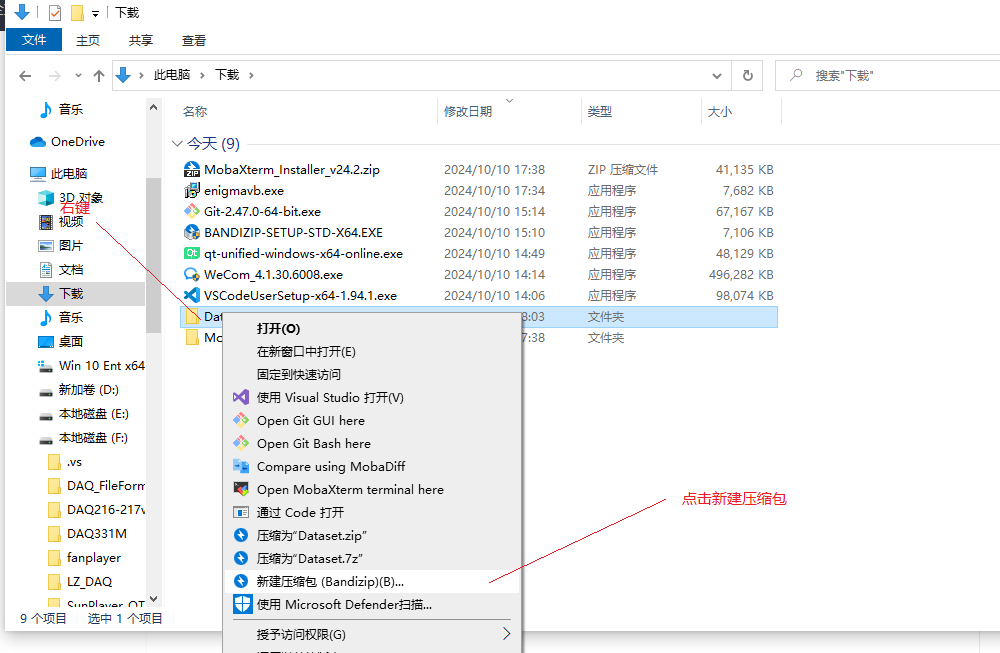

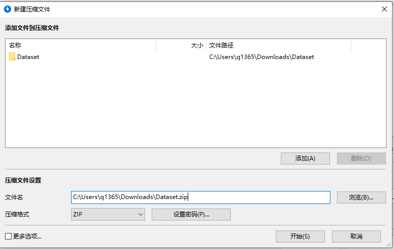

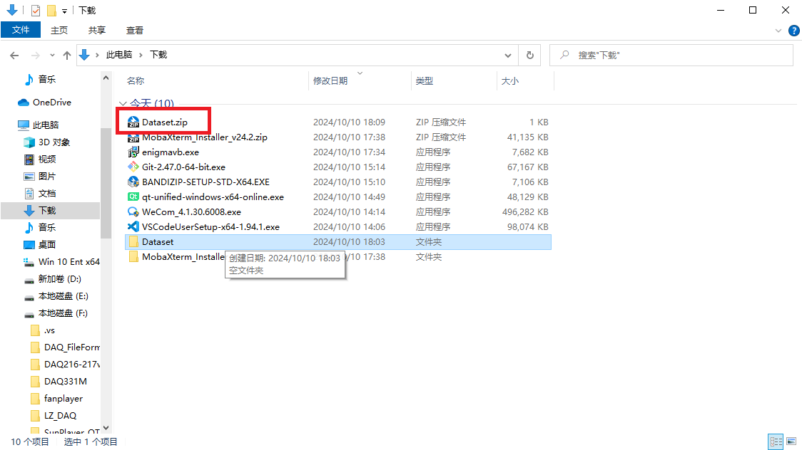

压缩完成后，打开压缩文件检查下最外层是否有 Dataset 目录

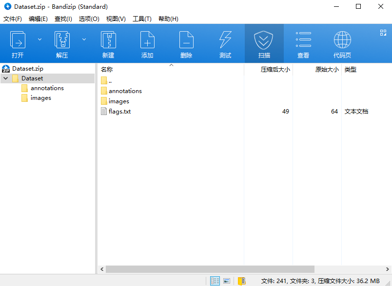


## 3 使用 AIStudio 训练检测模型

## 4 在凌智视觉模块上部署模型

训练完模型后，请参考以下教程在凌智视觉模块上部署检测模型例程：

<!-- * [凌智视觉模块检测模型 C++ 部署指南](./cpp/README.md) -->
* [凌智视觉模块检测模型 Python 部署指南](./python/README.md)

## 5 各模型性能指标

以下测试数据为模型执行 Predict 函数运行 1000 次耗时的平均时间

| 检测模型 | FPS(帧/s) | 精度(%) |
|:-------:|:----:|:----:|
|LZ-Picodet|||