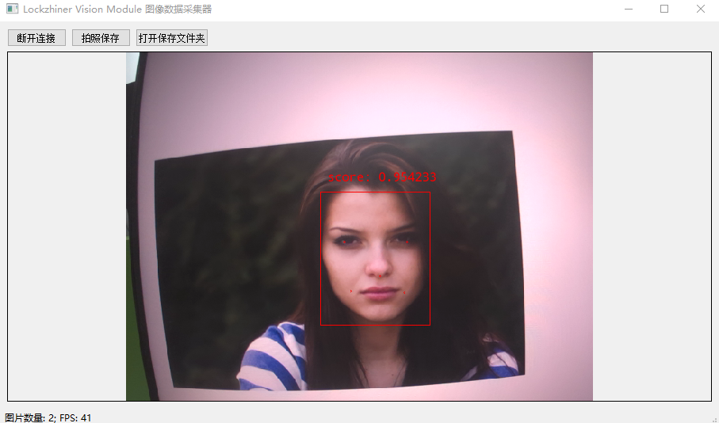

<h1 align="center">凌智视觉模块人脸检测模型 Python 部署指南</h1>

发布版本：V0.0.0

日期：2024-11-04

文件密级：□绝密 □秘密 □内部资料 ■公开  

---

**免责声明**  

本文档按**现状**提供，福州凌睿智捷电子有限公司（以下简称**本公司**）不对本文档中的任何陈述、信息和内容的准确性、可靠性、完整性、适销性、适用性及非侵权性提供任何明示或暗示的声明或保证。本文档仅作为使用指导的参考。  

由于产品版本升级或其他原因，本文档可能在未经任何通知的情况下不定期更新或修改。  

**读者对象**  

本教程适用于以下工程师：  

- 技术支持工程师  
- 软件开发工程师  

**修订记录**  

| **日期**   | **版本** | **作者** | **修改说明** |
| :--------- | -------- | -------- | ------------ |
| 2024/11/04 | 0.0.0    | 郑必城     | 初始版本     |

## 1 简介

接下来让我们基于 Python 来部署 RetinaFace 人脸检测模型。在开始本章节前：

- 请确保你已经参考 [凌智视觉模块人脸检测模型部署指南](../README.md) 正确下载了凌智视觉模块人脸检测模型。
- 请确保你已经按照 [开发环境搭建指南](../../../../docs/introductory_tutorial/python_development_environment.md) 正确配置了开发环境。

## 2 Python API 文档

```python
class Rect:
    def __init__(self):
        self.rect = cv2.Rect()

    def empty(self):
        return self.rect.empty()

    @property
    def x(self):
        """
        获取矩形左上角坐标点的 x 坐标

        Returns:
            int: 获取矩形左上角坐标点的 x 坐标
        """
        return self.rect.x

    @property
    def y(self):
        """
        获取矩形左上角坐标点的 y 坐标

        Returns:
            int: 获取矩形左上角坐标点的 y 坐标
        """
        return self.rect.y

    @property
    def width(self):
        """
        获取矩形的宽

        Returns:
            int: 获取矩形的宽
        """
        return self.rect.width

    @property
    def height(self):
        """
        获取矩形的高

        Returns:
            int: 获取矩形的高
        """
        return self.rect.height

class Point:
    def __init__(self):
        self.point = cv2.Point()

    @property
    def x(self):
        """
        获取坐标点的 x 坐标

        Returns:
            int: 坐标点的 x 坐标
        """
        return self.rect.x

    @property
    def y(self):
        """
        获取坐标点的 y 坐标

        Returns:
            int: 坐标点的 y 坐标
        """
        return self.rect.y

class FaceDetectionResult:
    """
    检测结果类，用于封装和处理人脸检测结果数据。

    该类主要提供了一个包装层，用于访问和管理由视觉模块产生的检测结果。
    """

    def __init__(self):
        self.face_detection_result = vision.FaceDetectionResult()

    @property
    def box(self):
        """
        获取人脸检测模型检测结果的矩形框信息

        Returns:
            Rect: 矩形框信息
        """
        return self.face_detection_result.box

    @property
    def score(self):
        """
        获取人脸检测模型检测结果的得分信息

        Returns:
            float: 得分信息
        """
        return self.face_detection_result.score

    @property
    def points(self):
        """
        获取人脸检测模型检测结果的人脸关键点信息， 一般共 5 个关键点

        Returns:
            list(cv2.Points): 关键点列表
        """
        return self.face_detection_result.points

class RetinaFace:
    """
    RetinaFace 类 - 用于人脸检测的 RetinaFace 模型封装。

    该类封装了 RetinaFace 框架下的目标检测模型，提供了初始化和预测的方法。
    """

    def __init__(self):
        """
        构造函数 - 初始化 PaddleDet 对象。
        """
        self.model = vision.RetinaFace()

    def initialize(self, model_path):
        """
        初始化模型 - 加载预训练的 RetinaFace 模型。

        Args:
            model_path (str): 模型文件的路径。

        Returns:
            bool: 初始化是否成功。
        """
        return self.model.initialize(model_path)

    def set_threshold(self, score_threshold=0.5, nms_threshold=0.3):
        """
        设置目标检测阈值

        Args:
            score_threshold (float): 目标检测得分阈值，默认为 0.5
            nms_threshold (float): 目标检测 NMS 阈值，默认为 0.3

        """
        self.model.initialize(score_threshold, nms_threshold)

    def predict(self, input_mat):
        """
        进行预测 - 使用加载的模型对输入数据进行分类预测。

        Args:
            input_mat (cv2.Mat): 输入的图像数据，通常是一个 cv2.Mat 变量。

        Returns:
            list(FaceDetectionResult): 预测结果对象列表，每一个预测结果包含了矩形框、人脸关键点和置信度等信息。
        """
        return self.model.predict(input_mat)
```

## 3 项目介绍

为了方便大家入手，我们做了一个简易的人脸检测例程。该程序可以使用摄像头进行端到端推理。

```python
from lockzhiner_vision_module.cv2 import VideoCapture
from lockzhiner_vision_module.vision import RetinaFace, visualize
from lockzhiner_vision_module.edit import Edit
import time
import sys

if __name__ == "__main__":
    args = sys.argv
    if len(args) != 2:
        print("Need model path. Example: python test_retina_face.py LZ-RetinaFace.rknn")
        exit(1)
        
    edit = Edit()
    edit.start_and_accept_connection()

    model = RetinaFace()
    if model.initialize(args[1]) is False:
        print("Failed to initialize RetinaFace")
        exit(1)

    video_capture = VideoCapture()
    if video_capture.open(0) is False:
        print("Failed to open capture")
        exit(1)

    while True:
        read_index = 0
        total_time_ms = 0
        for i in range(30):
            ret, mat = video_capture.read()
            if ret is False:
                continue

            start_time = time.time()
            results = model.predict(mat)
            end_time = time.time()
            total_time_ms += end_time - start_time
            read_index += 1

            print(f"result size is {len(results)}")
            for result in results:
                box = result.box
                score = result.score
                label_id = result.label_id
                print(
                    f"(x,y,w,h,score): [{box.x},{box.y},{box.width},{box.height},{score}]"
                )
            vis_mat = visualize(mat, results)
            edit.print(vis_mat)
        print(f"FPS is {1.0 / (total_time_ms/read_index)}")
```

## 4 上传并测试 Python 程序

参考 [连接设备指南](../../../../docs/introductory_tutorial/connect_device_using_ssh.md) 正确连接 Lockzhiner Vision Module 设备。


请使用 Electerm Sftp 依次上传以下两个文件:

- 进入存放 **test_retina_face.py** 脚本文件的目录，将 **test_retina_face.py** 上传到 Lockzhiner Vision Module
- 进入存放 **LZ-RetinaFace.rknn(也可能是其他模型)** 模型存放的目录（模型存放在训练模型后下载的 output 文件夹内），将 **LZ-RetinaFace.rknn** 上传到 Lockzhiner Vision Module


请使用 Electerm Ssh 并在命令行中执行以下命令:

```bash
python test_retina_face.py LZ-RetinaFace.rknn
```


连接凌智视觉模块图片传输助手[凌智视觉模块图片传输助手下载地址](https://gitee.com/LockzhinerAI/LockzhinerVisionModule/releases/download/v0.0.0/LockzhinerVisionModuleImageFetcher.exe)后，选择连接设备

运行程序后，屏幕上开始打印矩形框信息和置信度，并在一段时间后输出 FPS 值


<!-- ## 5 其他 -->

<!-- 如果你需要使用 C++ 来部署 PaddleClas 请参考[凌智视觉模块分类模型 C++ 部署指南](../cpp/README.md)。 -->
